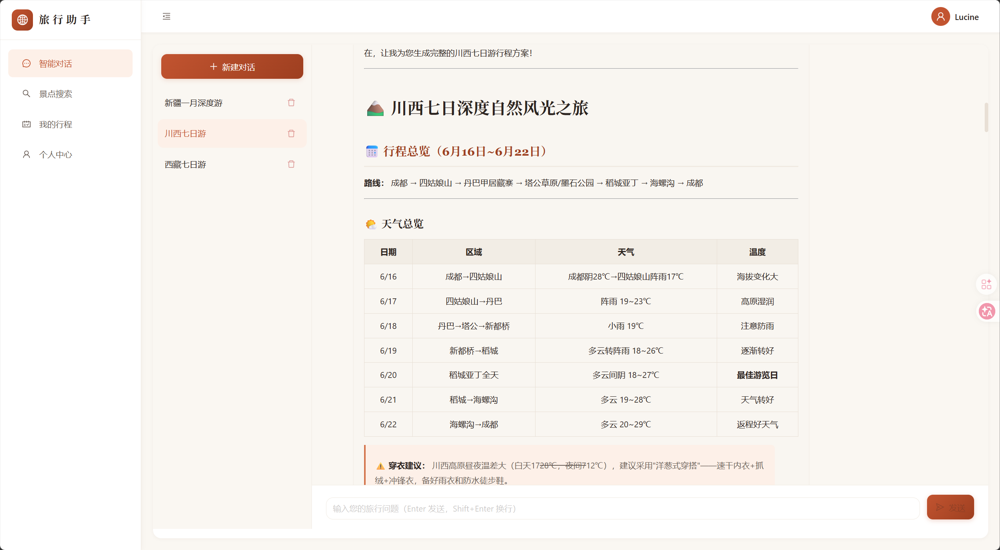
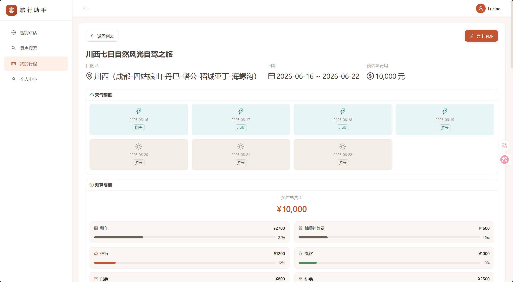
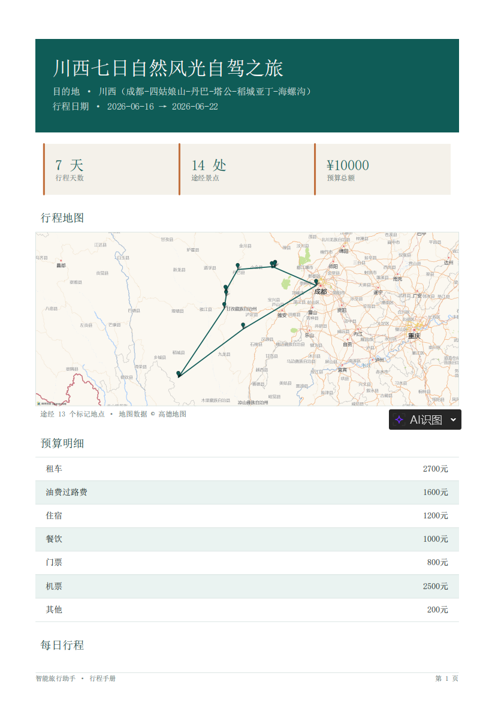

# 🧭 智能旅游助手 (Travel Assistant)

基于 LangChain 多 Agent 协作的智能旅游规划服务，支持 AI 对话式行程规划、景点搜索、路线规划、天气查询和预算估算。

## 📸 效果预览

### 前端样式

<p>
  
  
</p>

### PDF 样式

<p>
  
</p>

## ✨ 功能特性

- **🤖 AI 对话式行程规划** — 通过自然语言对话，AI 自动为你生成完整的旅游行程
- **📍 景点搜索** — 接入高德地图 API，搜索目的地周边景点信息
- **🗺️ 路线规划** — 智能规划出行路线，合理安排交通方式
- **🌤️ 天气查询** — 实时查询目的地天气，辅助行程决策
- **💰 预算估算** — 自动估算行程各项费用，支持预算明细
- **📄 行程导出** — 支持将行程导出为 PDF 文件
- **👤 用户系统** — JWT 认证，支持注册、登录和个人中心

## 🏗️ 技术架构

```
travel-assistant/
├── backend/                # 后端 — FastAPI + LangChain
│   ├── agents/             # AI Agent（规划/景点/路线/天气/预算）
│   ├── api/                # REST API 路由
│   ├── crud/               # 数据库操作层
│   ├── models/             # SQLAlchemy 数据模型
│   ├── schemas/            # Pydantic 数据校验
│   ├── services/           # 外部服务（高德地图/天气）
│   └── utils/              # 工具函数
├── frontend/               # 前端 — React + TypeScript + Vite
│   └── src/
│       ├── api/            # API 请求封装
│       ├── components/     # 通用组件
│       ├── layouts/        # 布局组件
│       ├── pages/          # 页面组件
│       └── store/          # 状态管理
└── tests/                  # 测试
    ├── test_agents/        # Agent 单元测试
    ├── test_api/           # API 集成测试
    ├── test_crud/          # CRUD 单元测试
    └── test_services/      # 服务层测试
```

### 技术栈

| 层级 | 技术 |
|------|------|
| **后端框架** | FastAPI 0.115+ |
| **AI 框架** | LangChain 0.3+ |
| **LLM** | DeepSeek API |
| **数据库** | SQLite (aiosqlite) |
| **ORM** | SQLAlchemy 2.0 (异步) |
| **前端框架** | React 19 + TypeScript |
| **构建工具** | Vite 8 |
| **UI 组件库** | Ant Design 6 |
| **路由** | React Router 7 |
| **认证** | JWT (python-jose + passlib) |
| **PDF 导出** | ReportLab |
| **地图服务** | 高德地图 API |

## 🚀 快速开始

### 环境要求

- Python >= 3.12
- Node.js >= 18
- [uv](https://docs.astral.sh/uv/)（Python 包管理器）

### 1. 克隆项目

```bash
git clone <repo-url>
cd travel-assistant
```

### 2. 配置环境变量

在项目根目录创建 `.env` 文件：

```env
# DeepSeek API
DEEPSEEK_API_KEY=sk-your-deepseek-api-key
DEEPSEEK_BASE_URL=https://api.deepseek.com/v1
DEEPSEEK_MODEL=deepseek-chat

# 高德地图 API
AMAP_API_KEY=your-amap-api-key

# 天气 API
WEATHER_API_KEY=your-weather-api-key

# JWT
JWT_SECRET_KEY=your-secret-key-change-in-production
JWT_EXPIRE_MINUTES=1440

# 数据库
DATABASE_URL=sqlite+aiosqlite:///./travel_assistant.db
```

### 3. 启动后端

```bash
# 安装依赖
uv sync

# 启动后端服务（默认 http://localhost:8000）
uv run uvicorn backend.main:app --reload --host 0.0.0.0 --port 8000
```

### 4. 启动前端

```bash
cd frontend

# 安装依赖
npm install

# 配置前端环境变量（复制 .env.example 并填入高德地图 JS API Key）
cp .env.example .env

# 启动开发服务器（默认 http://localhost:5173）
npm run dev
```

前端开发服务器已配置 API 代理，`/api` 请求会自动转发到后端 `http://localhost:8000`。

### 5. 访问应用

打开浏览器访问 [http://localhost:5173](http://localhost:5173)

## 🧪 运行测试

```bash
# 运行全部测试
uv run pytest

# 运行测试并查看覆盖率
uv run pytest --cov=backend --cov-report=html
```

## 📡 API 概览

| 方法 | 路径 | 说明 |
|------|------|------|
| POST | `/api/auth/register` | 用户注册 |
| POST | `/api/auth/login` | 用户登录 |
| GET | `/api/user/profile` | 获取个人信息 |
| GET | `/api/spots/search` | 搜索景点 |
| POST | `/api/chat` | AI 对话（SSE 流式响应） |
| GET | `/api/trips` | 行程列表 |
| POST | `/api/trips` | 创建行程 |
| GET | `/api/trips/{id}` | 行程详情 |
| DELETE | `/api/trips/{id}` | 删除行程 |
| GET | `/api/trips/{id}/export` | 导出行程 PDF |

## 📝 License

MIT
